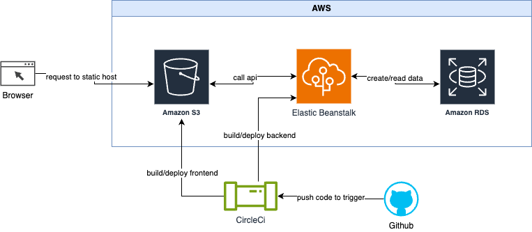

# Infrastructure

## Overview

This project application use AWS services:

- Relational Database Service (RDS): which is postgres db to store data.
- Elastic Beanstalk: to automatically upload and deploy api backend.
- Simple Storage Service (S3): buckets to host static website.

The CICD process is done by CircleCi that connect to the github source repo.
