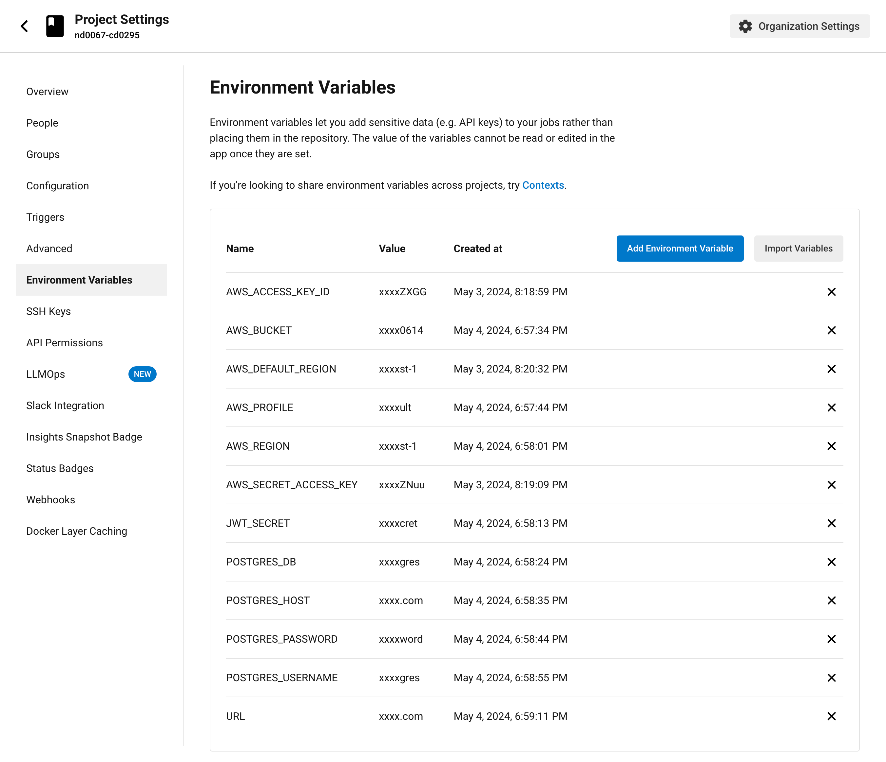
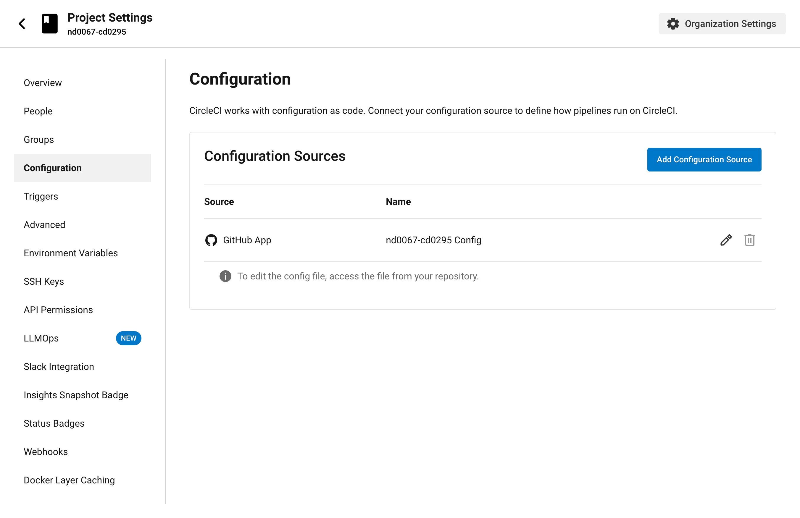
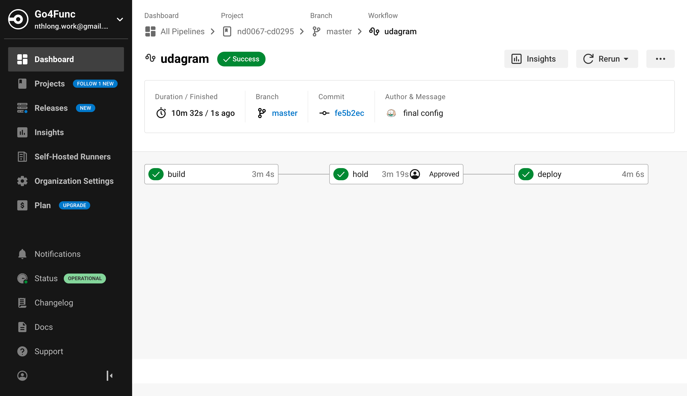
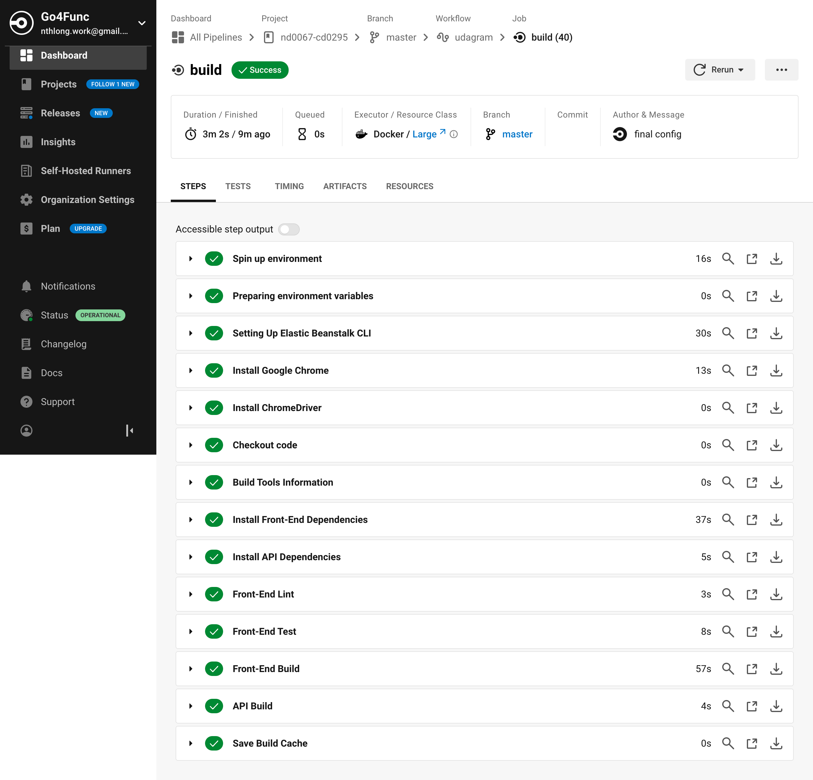
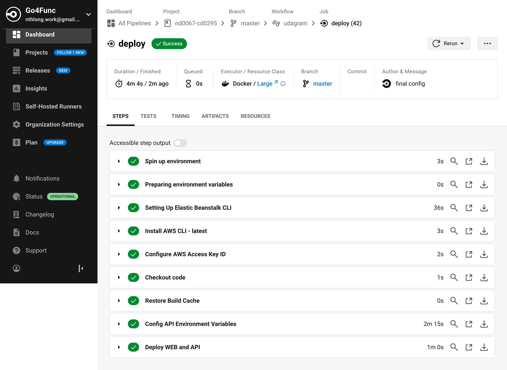

# CircleCI Pipeline

## Configuration

Configuration file can be found at [config.yaml](../.circleci/config.yml)

Application Secrets are configured in Environment Variables section.

### Trigger

The CircleCi pipeline connected to github source

A push commit to `master` branch will trigger the pipeline.

## Workflow

The workflow has 3 jobs that run the scripts from [package.json](../package.json)

### 1. Build

install dependencies, lint, test and build

### 2. Hold

After build job, need manually approve to run deploy job.

### 3. Deploy

deploy web and api.

