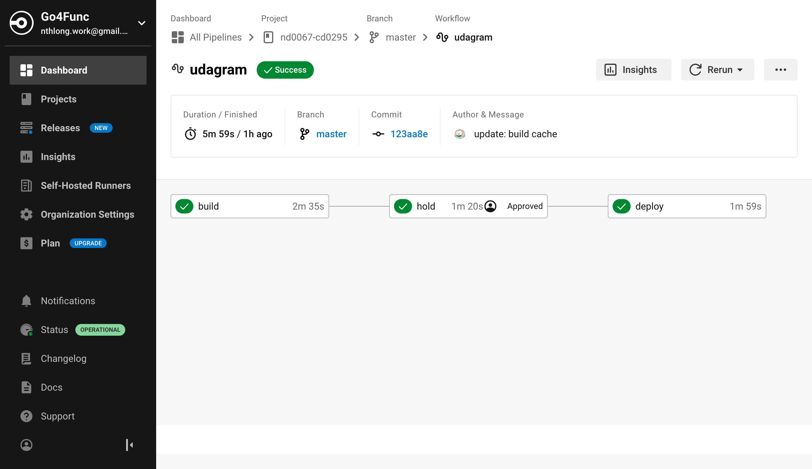
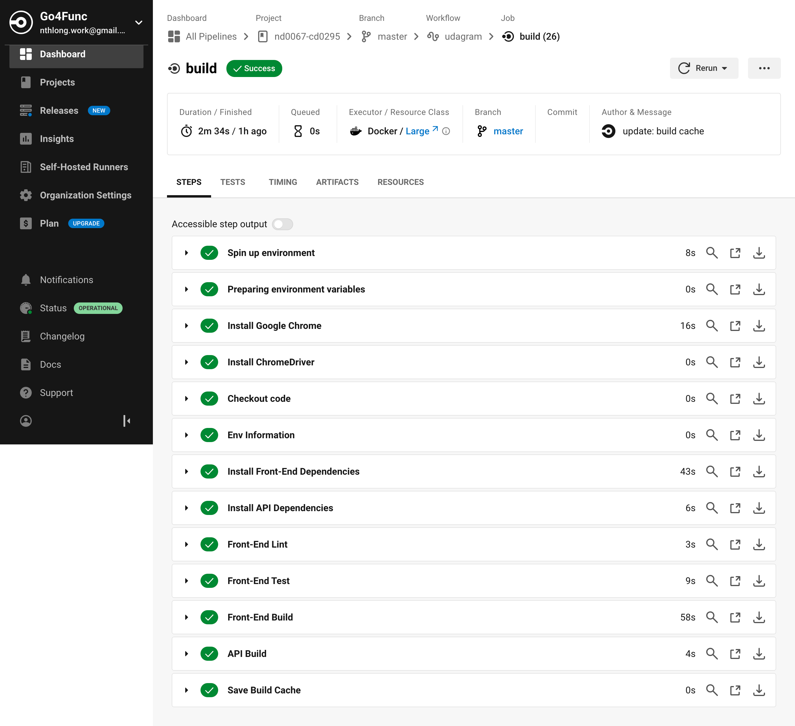
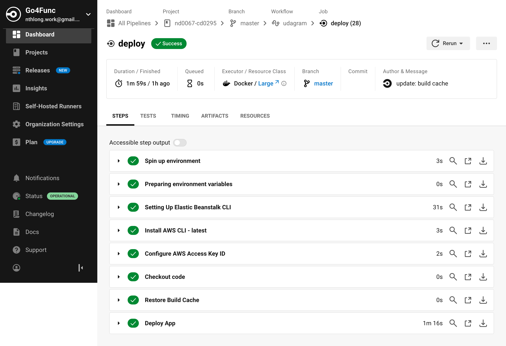
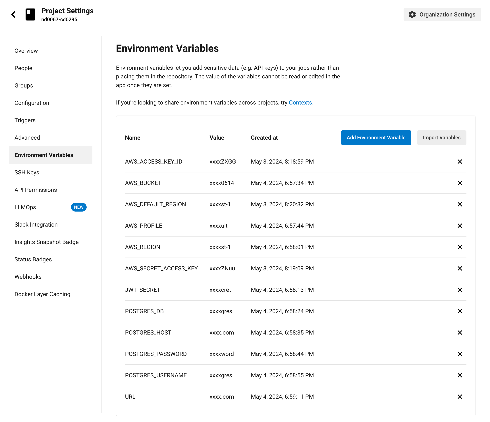

# CircleCI Pipeline

## Configuration

Configuration file can be found at [config.yaml](../.circleci/config.yml)

## Workflow

The workflow has 3 jobs that run the scripts from [package.json](../package.json)

- build: install dependencies, lint, test and build
- deploy: deploy web and api.

After build job, need manually approve to run deploy job.

### Trigger

A push commit to master branch will trigger the pipeline.

## Screenshot

